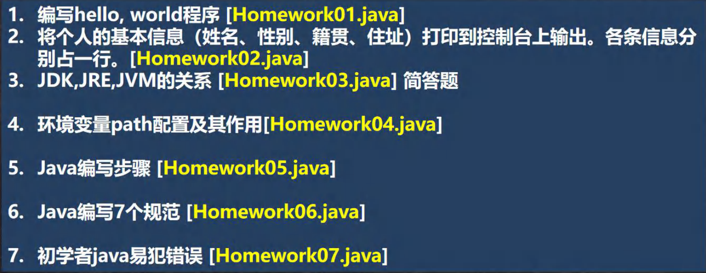

# Java概述-章节作业题目



## 编写hello world程序[Homework01.java]

```java
public class Homework01 { 

    //编写一个main方法
    public static void main(String[] args) {
        //编写hello, world程序
        System.out.println("hello,world"); 
    }
}
```

## 将个人的基本信息（姓名、性别、籍贯、住址）打印到控制台上输出。各条信息分别占一行[Homework02.java]

```java
//将个人的基本信息（姓名、性别、籍贯、住址）打印到控制台上输出。各条信息分别占一行
public class Homework02 { 

	//编写一个main方法
	public static void main(String[] args) {
		//考察队转义字符
		System.out.println("姓名\t性别\t籍贯\t住址\n顺平\t男\t四川\t北京"); 
	}
}
```

## JDK,JRE,JVM的关系[Homework03.java]
```java
答：
1. JDK = JRE + java开发工具
2. JRE = JVM + 核心类库
```

## 环境变量path配置及其作用[Homework04.java]

```java
1. 环境变量的作用是为了在dos的任意目录，可以去使用java 和 javac命令
2. 先配置 JAVA_HOME = 指向jdk安装的主目录
3. 编辑path环境变量，增加 %JAVA_HOME%\bin 
```

## Java编写步骤[Homework05.java]

```java
1. 编写java的源代码
2. javac 编译 ,得到对应的 .class 字节码文件
3. java 运行, 本质就是把 .class 加载到jvm  运行
```

## Java编写7个规范[Homework06.java]

```java
1. 类,方法的注释，使用javadoc的方式，即文档注释
2. 非javadoc注释，往往是对代码的说明(给程序的维护者),说明如何修改，注意事项
3. 使用tab ，整体将代码右移, 使用 shift+tab 整体左移
4. 运算符和 = 的两边，给空格，代码看上去清楚 int n = 1 + 4;
5. 源码文件使用 utf-8编码
6. 行宽字符不要超过 80
7. 代码编程风格有两种 次行风格，行尾风格(推荐)
```

## 初学者java易犯错误[Homework07.java]

```java
1. 编译或者运行时，找不到文件 javac Hell0.java, 把文件名或者目录找对
2. 主类名和文件名不一致 , 修改时保持一致即可
3. 缺少;
4. 拼写错误，比如 1 -> l 0->0, void -> viod , 要求写代码时，一定要小心
```