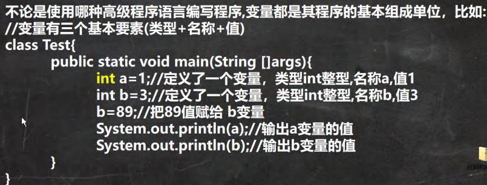
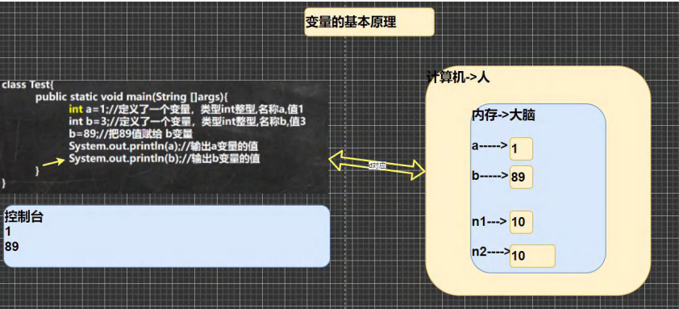
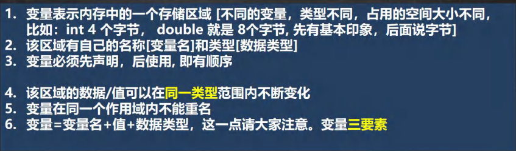

# 为什么需要变量

## 变量是程序的基本组成单位



```java
class Test{
    public static void main(String[] args){
    int a = 1; //定义一个变量，类型为int，变量名为a，并赋值为1
    int b = 3; //定义另一个变量，类型为int，变量名为b，并赋值为3
    b = 89; //把89赋值给b变量
    System.out.println(a); //输出a变量的值
    System.out.println(b); //输出b变量的值
    }
}
```

## 简单的原理示意图




# 变(变化)量(值)的介绍

## 概念

> 变量相当于内存中一个数据存储空间的表示，你可以把变量看做是一个房间的门牌号，通过门牌号我们可以找到房间，而通过变量名可以访问到变量(值)。

## 变量使用的基本步骤

+ 声明变量

int a;

+ 赋值

a = 60; //应该这么说: 把 60 赋给 a 使用 System.out.println(a);


# 变量快速入门

> 看演示并对代码进行说明， 演示记录 人的信息的代码

```java
public class Var02 { 

	//编写一个main方法
	public static void main(String[] args) {
		//记录人的信息
		int age = 30;
		double score = 88.9;
		char gender = '男';
		String name = "king";
		//输出信息, 快捷键
		System.out.println("人的信息如下:");
		System.out.println(name);
		System.out.println(age);
		System.out.println(score);
		System.out.println(gender);
	}
}
```

# 变量使用注意事项



>举例:

```java
public class VarDetail { 

	//编写一个main方法
	public static void main(String[] args) {
		//变量必须先声明，后使用, 即有顺序
		int a = 50;//int
		System.out.println(a);//50
		//该区域的数据/值可以在同一类型范围内不断变化
		//a = "jack"; //×
		a = 88; //对
		System.out.println(a);//88
		
		//变量在同一个作用域内不能重名
		//int a = 77;//错误
	}
}

//另外一个类
class Dog {
	public static void main(String[] args) {
		int a = 666;//对
	}
}
```

# 程序中的 + 号的使用

1. 当 `+` 号两边`都是数值类型`时，则做`加法运算`

2. 当 `+` 号两边有一个是`字符串类型`，则做`字符串拼接`

```java
System.out.println(100 + 98); ——> 198
System.out.println("100" + 98); ——> 10098

System.out.println(100 + 3 + "hello"); ——> 103hello
System.out.println("hello" + 100 + 3); ——> hello1003
```