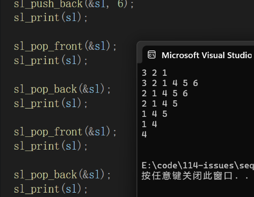

# 目录导航

[[toc]]

---

# 前言
本篇文章将详细介绍顺序表的基本搭建过程。
我们都知道顺序表的底层其实就是数组，但是既然有了数组为什么还要有顺序表呢？

其实相比如数组，顺序表还是有很多优势的。比如动态扩容、增删查改效率高、支持动态元素类型、停供更多的操作方法等。顺序表相对于数组具有更高的灵活性和功能性，可以更方便地对数据进行操作和管理。

## 数据结构
数据结构是由“数据”和“结构”两词组成。
什么是数据？数据是记录事实、观察结果或描述信息的集合，通常以数字、文字、图像或声音的形式存在。
什么是结构？简单来说结构就是组织数据的方式。

> 数据结构是指计算机存储、组织和管理数据的方式。

## 线性表
线性表是n个具有相同特性的数据元素的有限序列，线性表是一种在实际中广泛使用的数据结构，常见的线性表有：==顺序表、链表、栈、队列、字符串==……

线性表在逻辑上是线性结构，也就是连续的一条直线，但物理上并不一定连续，线性表在物理上存储时， 通常以数组和链式结构的形式存储。

## 顺序表

### 为什么要有顺序表？

>==顺序表的底层其实就是`数组`==。

顺序表是线性表的一种，并且顺序表在逻辑上和物理上都是线性的。

数组就可以管理数据，为什么还要有顺序表呢？数组也可以实现一些增删查改的操作，但是实现起来比较麻烦，于是顺序表就把这些比较麻烦的操作封装好，使我们使用起来更加方便。

### 概念及结构

顺序表是用一段`物理地址连续`的存储单元依次存储数据元素的线性结构，一般情况下采用`数组存储`。在数组上完成数据的增删查改。

>顺序表也分`静态顺序`表和`动态顺序表`。

1. 静态顺序表：使用定长数组存储。

2.  动态顺序表：使用动态开辟的数组存储。

静态顺序表底层是`定长数组`，==空间给大了浪费，给小了不够，有缺陷==。

动态顺序表的`空间大小是可变的`，是由动态内存函数`realloc`对开辟的动态内存空间进行调整。

>我们通常使用动态顺序表。

### 接口实现：

>静态顺序表只适用于确定知道需要存多少数据的场景。静态顺序表的`定长数组导致N定大了`，`空间开多了浪费，开少了不够用`。所以现实中基本都是使用动态顺序表，根据需要`动态的分配空间大小`，所以下面我们`实现动态顺序表`。

```c
// 顺序表的动态存储
typedef int sl_data_type
{
    sl_data_type* arr;  // 指向动态开辟的数组     
    int size;       // 表示数组中存储了多少个数据
    int capacity;   // 数组实际能存数据的空间容量是多大
}SL;

//顺序表初始化
void sl_init(SL* ps);
//头插
void sl_push_front(SL* ps, sl_data_type x);
//尾插
void sl_push_back(SL* ps, sl_data_type x);
//在指定位置之前插入数据
void sl_insert(SL* ps, int pos, sl_data_type x);
//头删
void sl_pop_front(SL* ps);
//尾删
void sl_pop_back(SL* ps);
//删除指定位置的数据
void sl_erase(SL* ps, int pos);
//顺序表的查找
int sl_find(SL* ps, sl_data_type x);
//顺序表打印
void sl_print(const SL sl);
//顺序表销毁
void sl_destroy(SL* ps);
```
### 创建和初始化

首先我们需要一个指针来接收由动态内存函数开辟的空间，还需要一个变量记录当前顺序表内数据个数，因为我们创建的是动态顺序表，大小经常变化，所以我们还需要一个变量来记录当前空间的大小。最后我们再把这些值封装到一个结构体中，这个结构体就是我们要创建的动态顺序表。

```c
//顺序表管理数据的类型
typedef int sl_data_type;

typedef struct seqlist
{
	sl_data_type* arr;
	int size;//表示数组中存储了多少个数据
	int capacity;//空间大小
}SL;
```
我们希望创建的顺序表能管理多种类型的数据，所以使用类型重定义标识符typedef。
创建好顺序表后，为了以后使用方便我们将它的初始化步骤也分装成一个函数：

```c
void sl_init(SL* ps)
{
	ps->arr = NULL;
	ps->size = 0;
	ps->capacity = 0;
}
```
注意指针要赋`NULL`。


### 头插

创建和初始化顺序表后，我们来实现在顺序表头部插入数据。

插入数据是直接插吗？不是的，我们还需要判断当前顺序表中是否有足够的空间让我们插入数据，因为不管是哪种插入的方式都要进行判断，所以我们干脆把这一步骤分装成一个函数，方便后续使用。

如何判断当前顺序表是否有足够的空间呢？是ps->capacity>0吗？
不是的，因为有一种特殊情况是当前顺序表的空间刚好被使用完，合理的判断条件是当ps->size == ps->capacity时，我们申请空间。
但是申请空间又有一个问题摆在我们面前：申请多大？仿佛又回到了定长数组的问题。
不过不要慌，由数学推理得出，一次申请空间大小是原空间大小2倍最合理。
```c
//检查是否有空间允许插入数据
void check_capacity(SL* ps)
{
	if (ps->size == ps->capacity)
	{
		int newcapacity = ps->capacity == 0 ? 4 : 2 * ps->capacity;//为了处理capacity为0的问题
		sl_data_type* tmp = (sl_data_type*)realloc(ps->arr, newcapacity * sizeof(sl_data_type));
		if (tmp == NULL)
		{
			perror("realloc fail!");
			exit(1);
		}
		ps->arr = tmp;
		tmp = NULL;
		ps->capacity = newcapacity;//及时更新空间大小
	}
}
```
空间大小需要乘以相应类型的大小。
在使用realloc函数时不要忘了其返回值也有为NULL的可能，所以需要一个临时指针过渡，这个临时指针使用完也不要忘了赋NULL，以防止其成为野指针。
顺序表的空间大小最后也不要忘了及时更新。
判断是否有足够的空间后，接下来就是在顺序表的头部插入数据。
我们先要将原先的数据向后挪动一位，将顺序表的第一位空出来，插入我们想插入的数据。

```c
void sl_push_front(SL* ps, sl_data_type x)
{
	assert(ps != NULL);
	check_capacity(ps);
	int i = 0;
	for (i = ps->size; i > 0; i--)
	{
		ps->arr[i] = ps->arr[i - 1];
	}
	ps->arr[0] = x;
	ps->size++;
}
```
开始插入操作之前，为了防止意外我们先判断一下传过来的顺序表的指针是否为空。
最后不要忘了给顺序表内记录数据个数的变量`++`。

### 尾插

相比于头插，尾插没有挪动原有数据的操作，在判断完空间大小和数据个数后直接在数据末尾插入就行，同样也不要忘了让记录数据个数的变量`++`

```c
void sl_push_back(SL* ps, sl_data_type x)
{
	assert(ps != NULL);
	check_capacity(ps);
	ps->arr[ps->size++] = x;
}
```

### 在指定位置前插入

顺序表中不止在头部和尾部插入数据，也可在指定的任意有效位置插入数据，所以我们的函数就要多一个指定位置的参数。
指定的位置还必须要有效，因为顺序表中的数据一定是连续的。
插入之前，我们需要将指定位置后面的数据往后挪动一位，给要插入的数据留出空间。

```c
void sl_insert(SL* ps, int pos, sl_data_type x)
{
	assert(ps != NULL);
	assert(pos >= 0 && pos <= ps->size);//确保指定的位置是有效的
	check_capacity(ps);
	int i = 0;
	for (i = ps->size; i > pos; i--)
	{
		ps->arr[i] = ps->arr[i - 1];
	}
	ps->arr[pos] = x;
	ps->size++;
}
```
插入数据后，记录数据个数的变量不要忘了`++`。

### 头删

在删除完顺序表的第一个数据后，也需要将剩余的数据向前挪动一位，以确保数据是在下标为0处开始。
在删除数据之前，我们还要考虑到一种特殊情况，就是当前顺序表中没有数据，那没有数据肯定是不能进行删除操作的。

```c
void sl_pop_front(SL* ps)
{
	assert(ps != NULL);
	assert(ps->size != 0);//顺序表为空不能删除
	int i = 0;
	for (i = 0; i < ps->size - 1; i++)
	{
		ps->arr[i] = ps->arr[i + 1];
	}
	ps->size--;
}
```
删除操作完成后，数据个数`–`；

### 尾删

尾删则比较简单，因为我们只需要让记录数据个数的变量-1，在访问顺序表的时候访问不到这个数据，就相当于删除了这个数据
同样的，尾删也需要考虑当前数据个数是否为0的情况。

```c
void sl_pop_back(SL* ps)
{
	assert(ps != NULL);
	assert(ps->size != 0);//顺序表为空不能删除
	ps->size--;
}
```
### 删除指定位置的数据

这个指定的位置也必须是有效的。
同时也要保证当前顺序表中的数据个数不为0。

```c
void sl_erase(SL* ps, int pos)
{
	assert(ps != NULL);
	assert(ps->size != 0);//实际下面的断言侧面完成了这句代码
	assert(pos >= 0 && pos < ps->size);//确保指定的位置是有效的
	int i = 0;
	for (i = pos; i < ps->size - 1; i++)
	{
		ps->arr[i] = ps->arr[i + 1];
	}
	ps->size--;
}
```
### 顺序表的查找

想要在顺序表中查找一个数据，只需要像遍历数组一样遍历顺序表就行。
找到则返回数据对应的下标，找不到则返回-1。

```c
int sl_find(SL* ps, sl_data_type x)
{
	assert(ps != NULL);
	int i = 0;
	for (i = 0; i < ps->size; i++)
	{
		if (ps->arr[i] == x)
		{
			return i;
		}
	}
	return -1;
}
```

### 顺序表销毁

我们向内存申请了一块空间使用完成后，还要归还给操作系统
在上面调整顺序表大小的操作中，我们使用的是动态内存函数realloc，因此还要使用函数free释放掉动态开辟的空间，也不要忘了给指针赋NULL

```c
void sl_destroy(SL* ps)
{
	assert(ps != NULL);
	if (ps->arr != NULL)//动态内存函数开辟了空间
	{
		free(ps->arr);
	}
	ps->arr = NULL;
	ps->size = 0;
	ps->capacity = 0;
}
```

### 测试

为了对我们创建的顺序表进行测试，方便起见再写一个打印函数。

```c
void sl_print(const SL sl)
{
	int i = 0;
	for (i = 0; i < sl.size; i++)
	{
		printf("%d ", sl.arr[i]);
	}
	printf("\n");
}
```
测试代码如下：

```c
void test()
{
	SL sl;
	sl_init(&sl);
	sl_push_front(&sl, 1);
	sl_push_front(&sl, 2);
	sl_push_front(&sl, 3);
	sl_print(sl);

	sl_push_back(&sl, 4);
	sl_push_back(&sl, 5);
	sl_push_back(&sl, 6);
	sl_print(sl);

	sl_pop_front(&sl);
	sl_print(sl);

	sl_pop_back(&sl);
	sl_print(sl);

	sl_pop_front(&sl);
	sl_print(sl);

	sl_pop_back(&sl);
	sl_print(sl);

	sl_pop_front(&sl);
	sl_print(sl);

	sl_pop_back(&sl);
	sl_print(sl);

	sl_destroy(&sl);
}
```
运行结果：



结果和我们预期的效果一致。
整个程序的原码如下：

`seqlist.h`:

```c
#pragma once

#include <stdio.h>
#include <stdlib.h>
#include <assert.h>

//顺序表管理数据的类型
typedef int sl_data_type;

typedef struct seqlist
{
	sl_data_type* arr;
	int size;//数据个数
	int capacity;//空间大小
}SL;

//顺序表初始化
void sl_init(SL* ps);
//头插
void sl_push_front(SL* ps, sl_data_type x);
//尾插
void sl_push_back(SL* ps, sl_data_type x);
//在指定位置之前插入数据
void sl_insert(SL* ps, int pos, sl_data_type x);
//头删
void sl_pop_front(SL* ps);
//尾删
void sl_pop_back(SL* ps);
//删除指定位置的数据
void sl_erase(SL* ps, int pos);
//顺序表的查找
int sl_find(SL* ps, sl_data_type x);
//顺序表打印
void sl_print(const SL sl);
//顺序表销毁
void sl_destroy(SL* ps);
```
`seqlist.c`:
```c
#define  _CRT_SECURE_NO_WARNINGS

#include "seqlist.h"

void sl_init(SL* ps)
{
	ps->arr = NULL;
	ps->size = 0;
	ps->capacity = 0;
}

//检查是否有空间允许插入数据
void check_capacity(SL* ps)
{
	if (ps->size == ps->capacity)
	{
		int newcapacity = ps->capacity == 0 ? 4 : 2 * ps->capacity;//为了处理capacity为0的问题
		sl_data_type* tmp = (sl_data_type*)realloc(ps->arr, newcapacity * sizeof(sl_data_type));
		if (tmp == NULL)
		{
			perror("realloc fail!");
			exit(1);
		}
		ps->arr = tmp;
		tmp = NULL;
		ps->capacity = newcapacity;//及时更新空间大小
	}
}

void sl_push_front(SL* ps, sl_data_type x)
{
	assert(ps != NULL);
	check_capacity(ps);
	int i = 0;
	for (i = ps->size; i > 0; i--)
	{
		ps->arr[i] = ps->arr[i - 1];
	}
	ps->arr[0] = x;
	ps->size++;
}

void sl_push_back(SL* ps, sl_data_type x)
{
	assert(ps != NULL);
	check_capacity(ps);
	ps->arr[ps->size++] = x;
}

void sl_insert(SL* ps, int pos, sl_data_type x)
{
	assert(ps != NULL);
	assert(pos >= 0 && pos <= ps->size);//确保指定的位置是有效的
	check_capacity(ps);
	int i = 0;
	for (i = ps->size; i > pos; i--)
	{
		ps->arr[i] = ps->arr[i - 1];
	}
	ps->arr[pos] = x;
	ps->size++;
}

void sl_pop_front(SL* ps)
{
	assert(ps != NULL);
	assert(ps->size != 0);//顺序表为空不能删除
	int i = 0;
	for (i = 0; i < ps->size - 1; i++)
	{
		ps->arr[i] = ps->arr[i + 1];
	}
	ps->size--;
}

void sl_pop_back(SL* ps)
{
	assert(ps != NULL);
	assert(ps->size != 0);//顺序表为空不能删除
	ps->size--;
}

void sl_erase(SL* ps, int pos)
{
	assert(ps != NULL);
	assert(ps->size != 0);
	assert(pos >= 0 && pos < ps->size);//确保指定的位置是有效的
	int i = 0;
	for (i = pos; i < ps->size - 1; i++)
	{
		ps->arr[i] = ps->arr[i + 1];
	}
	ps->size--;
}

int sl_find(SL* ps, sl_data_type x)
{
	assert(ps != NULL);
	int i = 0;
	for (i = 0; i < ps->size; i++)
	{
		if (ps->arr[i] == x)
		{
			return i;
		}
	}
	return -1;
}

void sl_print(const SL sl)
{
	int i = 0;
	for (i = 0; i < sl.size; i++)
	{
		printf("%d ", sl.arr[i]);
	}
	printf("\n");
}

void sl_destroy(SL* ps)
{
	assert(ps != NULL);
	if (ps->arr != NULL)//动态内存函数开辟了空间
	{
		free(ps->arr);
	}
	ps->arr = NULL;
	ps->size = 0;
	ps->capacity = 0;
}
```
`test.c`:

```c
#define  _CRT_SECURE_NO_WARNINGS

#include "seqlist.h"

void test()
{
	SL sl;
	sl_init(&sl);
	sl_push_front(&sl, 1);
	sl_push_front(&sl, 2);
	sl_push_front(&sl, 3);
	sl_print(sl);

	sl_push_back(&sl, 4);
	sl_push_back(&sl, 5);
	sl_push_back(&sl, 6);
	sl_print(sl);

	sl_pop_front(&sl);
	sl_print(sl);

	sl_pop_back(&sl);
	sl_print(sl);

	sl_pop_front(&sl);
	sl_print(sl);

	sl_pop_back(&sl);
	sl_print(sl);

	sl_pop_front(&sl);
	sl_print(sl);

	sl_pop_back(&sl);
	sl_print(sl);

	sl_insert(&sl, 0, 4);
	sl_print(sl);

	sl_erase(&sl, 1);
	sl_print(sl);
	
	int ret = sl_find(&sl, 3);
	if (ret >= 0)
	{
		printf("%d\n", sl.arr[ret]);
	}
	else
	{
		printf("没找到");
	}
	
	sl_destroy(&sl);
}

int main()
{
	test();
	return 0;
}
```

# 总结

+ 我们常用的是动态顺序表，通过realloc函数来对空间大小适当的扩容

+ 顺序表中的元素在内存中是连续存储的，可以通过下标直接访问元素，提高了查找效率

+ 适合： 频繁访问、很少插入和删除的数据集合。由于顺序表支持通过下标直接访问元素，适合频繁读取和遍历元素的场景

+ 不适合： 频繁插入和删除的场景。由于插入和删除操作需要移动数据，频繁插入和删除会影响性能，不适合该类场景