# 目录导航

[[toc]]

---

<!-- index.md -->
<update />

# 数据结构的基本概念和术语

## 数据，数据元素，数据项，数据对象

+ **数据(Data)**:`是客观事物的符号化表示，在计算机科学中指的是所有能输入到计算机程序中并被计算机程序处理的符号的总称`。

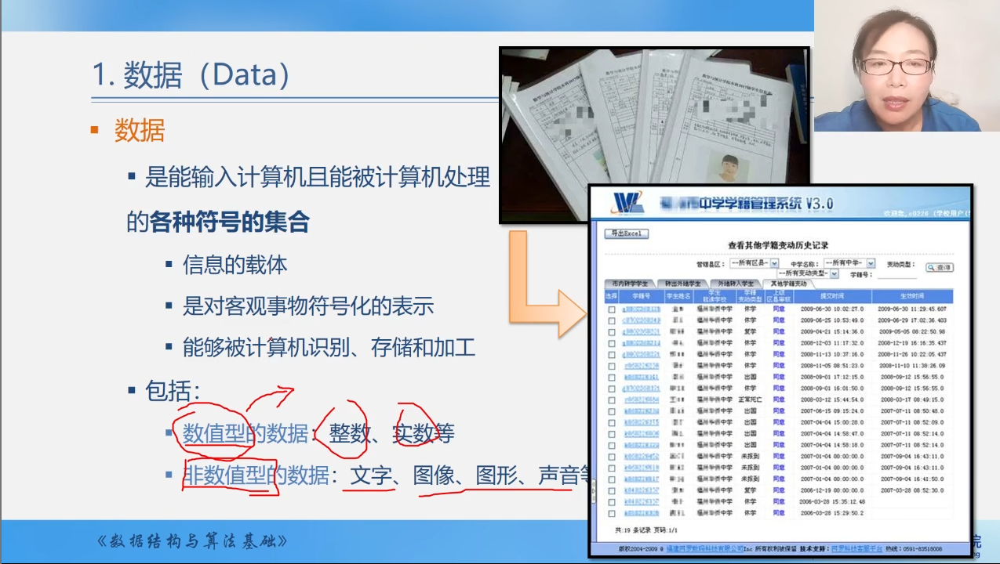

+ **数据元素(Data Element)**:是数据的基本单位，在程序中通常`作为一个整体`来进行考虑和处理。

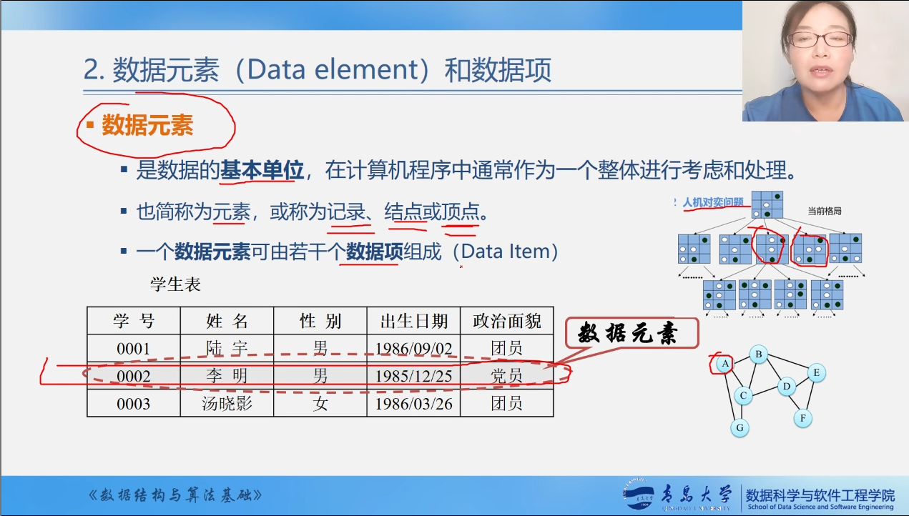

+ **数据项(Data Item)**:是指数据元素的组成部分，如整数、实数、字符、字符串等。数据项对客观事物某一方面特性的数据描述。

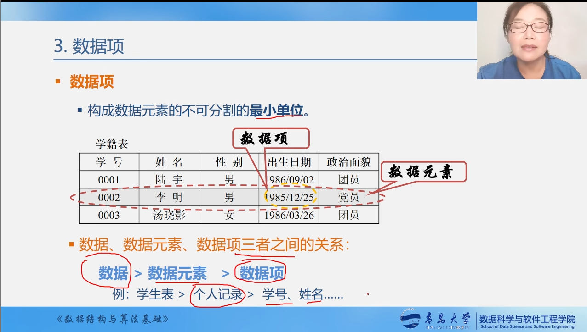

+ **数据对象(Data Object)**:是指数据元素的集合，如数组、链表、树、图等。

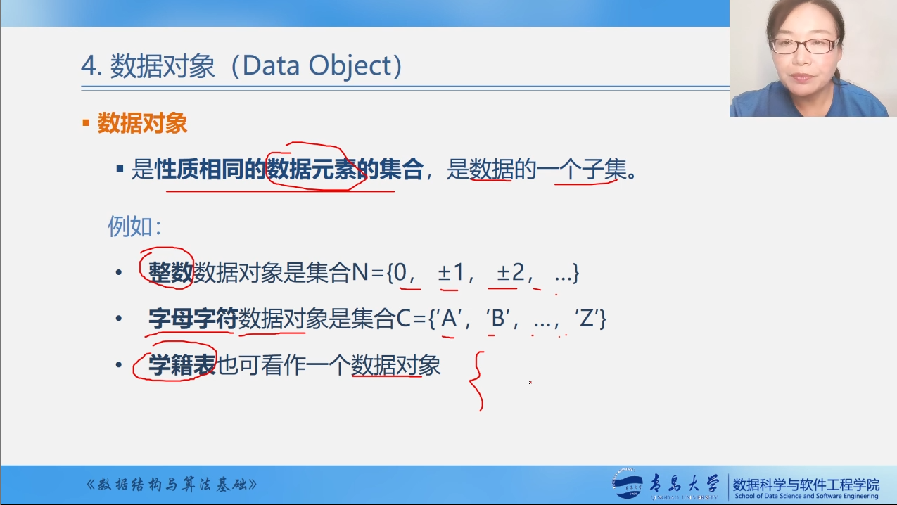

>`数据元素与数据对象的关系`：

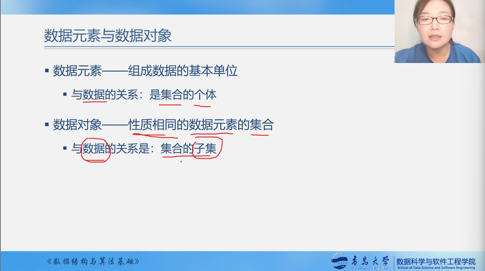

# 数据结构(Data Structure)

`概念`：数据结构(Data Structure)是`相互之间存在一种或多种特定关系的数据元素的集合`，换句话说，**数据结构是带"结构"的数据元素的集合**，**"结构"就是指数据元素之间的相互关系**。

>数据结构包括以下三个方面的内容：

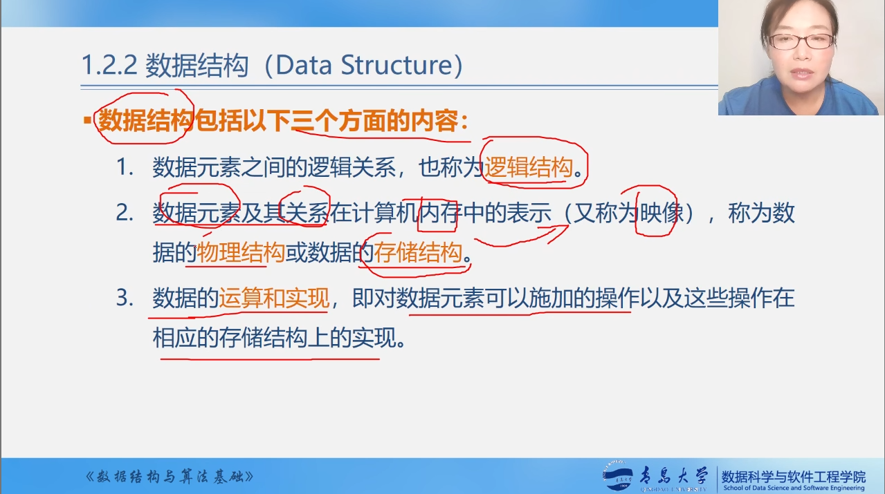

## 数据结构的两个层次

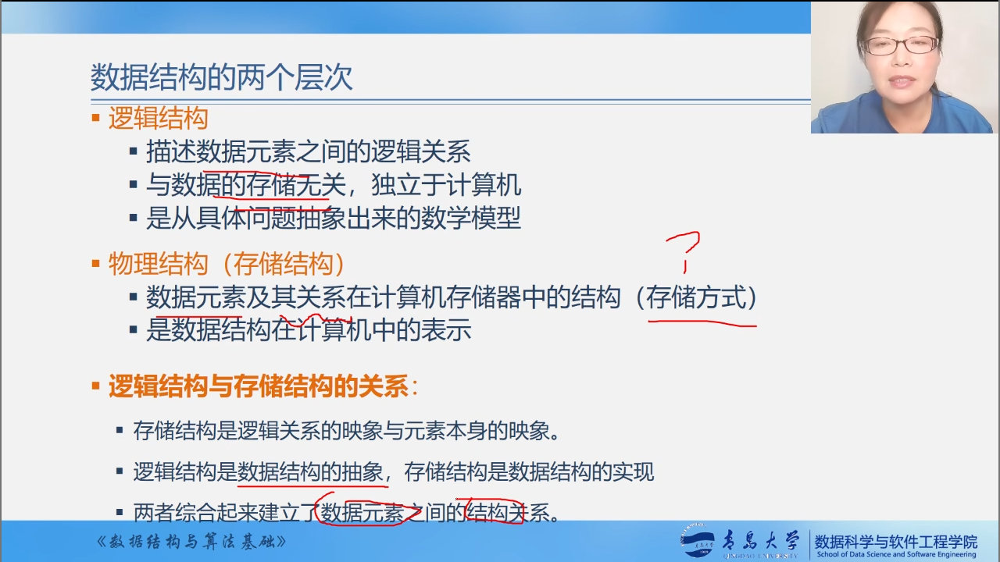

## 逻辑结构

`概念`：逻辑结构(Logical Structure)是从逻辑关系上描述数据，它与物理结构无关，是独立于计算机的。

+ `以线性结构和非线性结构划分`

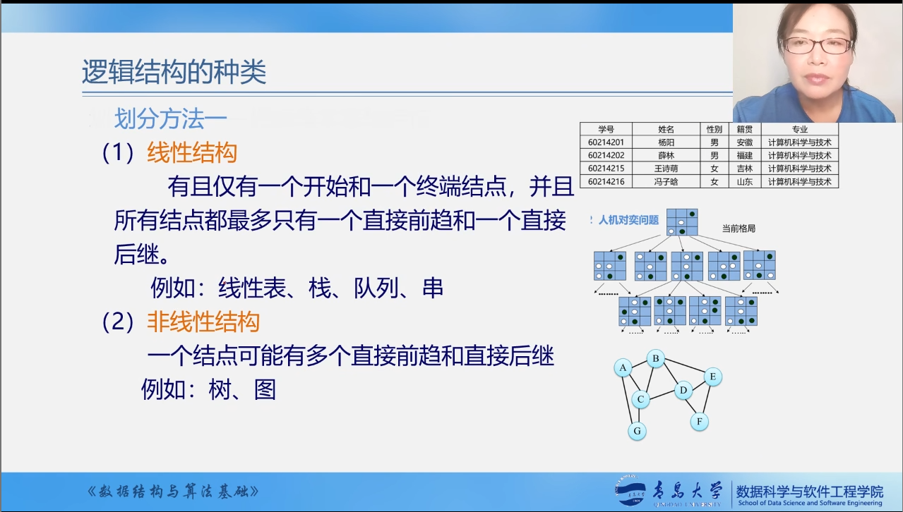

+ `以集合、线性结构、树形结构、图形结构划分`

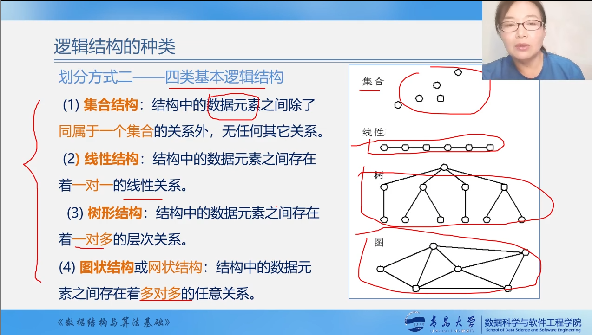

## 存储结构

`概念`：存储结构(Storage Structure)是指数据对象在计算机中的`存储结构`，也称为`物理结构`。

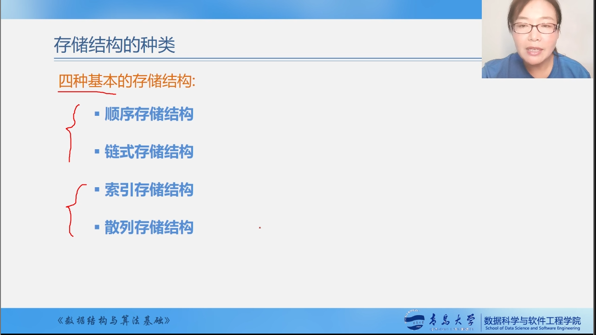

+ `以顺序存储结构和链式存储结构划分`

>顺序存储结构:数据元素按`先后顺序`存储在计算机的`连续存储区`中。

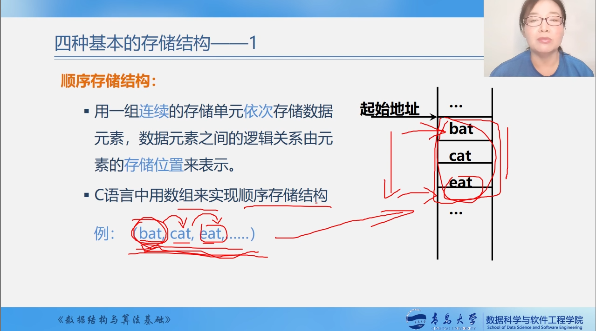

>链式存储结构:`我们在存储没有元素的本身的时候也存储了下一个元素的首地址`。

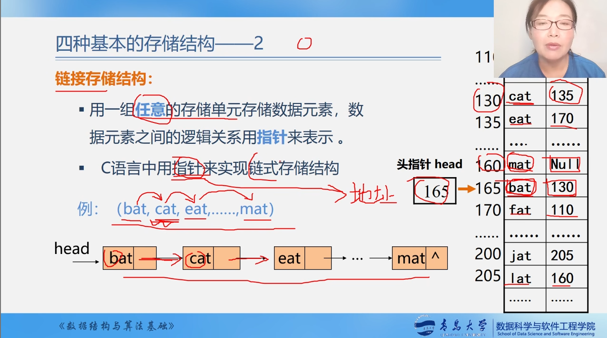

+ `以索引存储结构和散列存储结构划分`

>索引存储结构:在存储结点信息的同时，还建立附加的`索引表`。

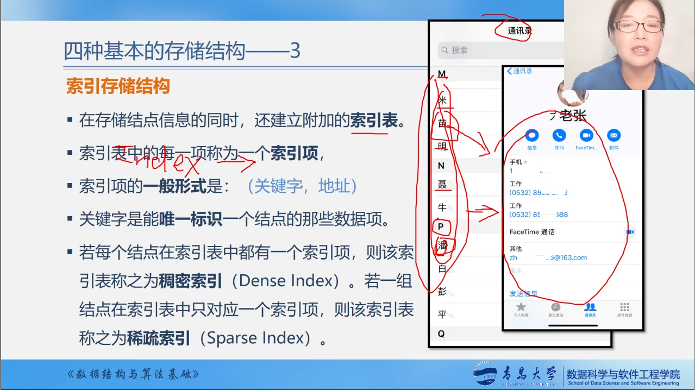

>散列存储结构:根据结点的关键字`直接计算出该结点的存储地址`。

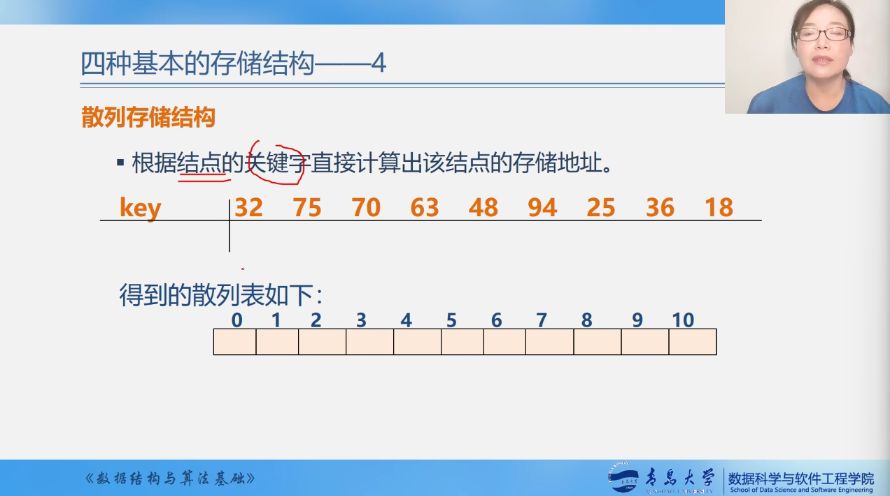